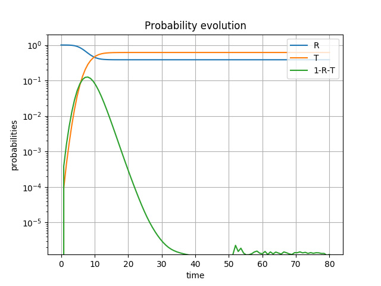
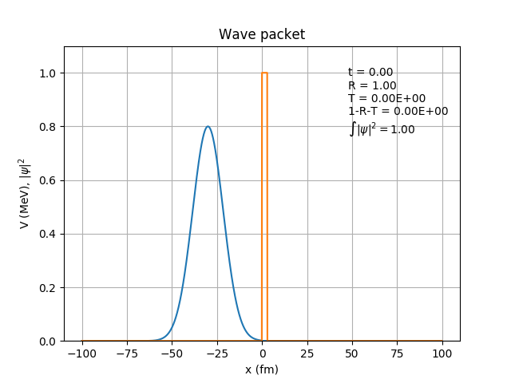
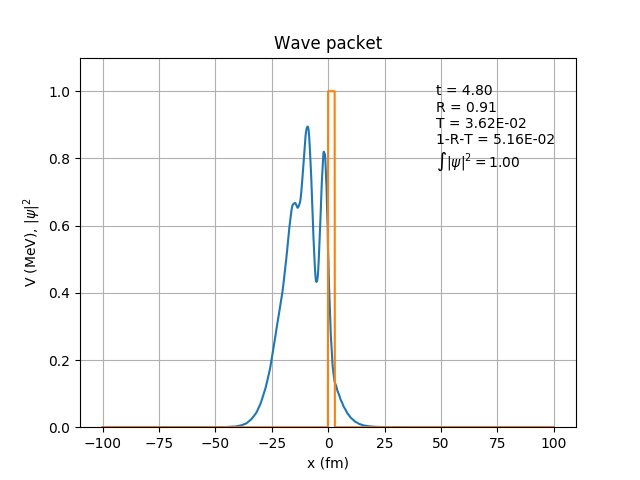
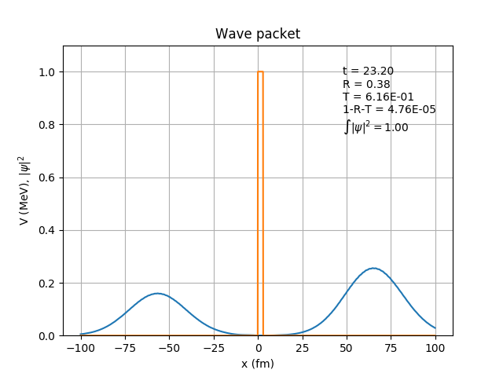

# pyTunnel

Python implementation of the Crank-Nicolson Method for 
solving the Time-Dependent Schrodinger Equation. 
The implementation and notation follows closely that of 
[Christoph Wachter's Bachelor thesis (2017)](http://physik.uni-graz.at/~pep/Theses/BachelorThesis_Wachter_2017.pdf), 
apart from the absorbing boundary conditions, which are not 
included here.
Equations are expressed in units where 
$`\hbar = 1`$ and $`m = 0.5`$. The physical system 
considered is a Gaussian wave packet tunneling through 
a rectangular barrier, which may be time-dependent.

# Installation

pyTunnel requires python3 and the packages numpy,scipy, matplotlib, tqdm, and Pint. 

With python3 installed, proceed by creating a virtual environment and installing 
the required packages:
```terminal
  python3 -m venv pytunnel-env
  source pytunnel-env/bin/activate
  pip install -r requirements.txt
```
The first command create a virtual environment called pytunnel-env.
The second command activates the environment.
The third command install the packages listed in requirements.txt.

Now, clone the project from the git repository:
```terminal
  git clone https://git.kern.phys.au.dk/oliskir/pytunnel.git
```

Finally, step into the project folder and install the pytunnel package:
```terminal
  cd pytunnel/
  python setup.py sdist
  pip install dist/pytunnel-0.0.1.tar.gz 
```

# Usage

Execute the program with the command:
```terminal
  pytunnel -c <path/to/json/configuration/file>
```

## Configuration file

The json configuration file looks like this:
```txt
{
    "energy": "0.5MeV",
    "mass": "3.7GeV",
    "sigma": "600fm",
    "initial_sep": "5000fm",
    "barrier_type": "Square",
    "barrier_params": {
        "width": "20fm", 
        "initial_height": "1.0MeV", 
        "final_height": "1.0MeV",
        "transition_pos": "10fm" 
    },
    "domain_size": "20000fm",
    "display_size": "10000fm",
    "absorb_frac": 0.05,
    "rel_accuracy": 0,
    "num_frames": 100,
    "y_min": 1e-16,
    "output_dir": "output",
    "save_frames": "True",
    "dx": "0.05fm"
}
```

Here is a quick rundown of the contents of the configuration file:

 * energy: Kinetic energy of the wave packet
 * mass: Rest mass of the wave packet
 * sigma: Standard deviation of the wave packet
 * initial_sep: Initial separation of the wave packet's centroid from the left edge of the barrier 
 * barrier_type: Potential barrier type*
 * barrier_params: Parameters specifying the shape and size of the barrier. 
 * domain_size: Size of the computional domain (which is centered at $`x=0`$). 
        The wave packet will be reflected if it reaches the boundary of the computational domain 
        before the calculation is terminated.
 * display_size: Domain used for plotting the wave function (also centered at $`x=0`$)
 * absorb_frac: Calculation will be terminated when the ratio of absorbed to transmitted wave is below this level; if zero, the calculation is terminated when the wave packet reaches the boundary**.
 * rel_accuracy: Desired relative numerical accuracy***; if non-zero, the bin size will be automatically determined to ensure the desired accuracy; if zero, the bin size specified by the user will be used
 * num_frames: Number of snapshots taken of the time evolution of the wave packet
 * y_min: Lower limit of the y-axis. The axis will be linear if set to zero, and logarithmic if set to a value 
        greater than 0. 
 * output_dir: Directory where output files will be saved.
 * save_frames: Save snapshots of the time evolution of the wave packet
 * dx: Spatial bin size
 * dt: Temporal bin size (if set to 'auto', will be calculated as the spatial bin size divided by the wave-packet mean speed)

*Currently, only a square barrier is available. However, adding another type of barrier is 
straightforward if you know a little Python. Details are provided in [barriers.py](pytunnel/barriers.py).

**More specifically, the calculation is terminated when the centroid of the wave packet would have 
reached the boundary in the absence of any potential barrier.

***Measured as the relative error in the position of the wave-packet centroid compared to the classical expectation, which is simply the time elapsed multiplied by the velocity


## Command-line arguments

In addition to the configuration file, a few command-line arguments are available, which will overwrite 
settings from the configuration file.

| option | long option |  description  |
| -------- | -------- | -------- |
|  -c  |  --config_file  |  json configuration file  |
|  -e  |  --energy  |  kinetic energy of incident particle (example: -e '1.2MeV') |


## Output

The program produces an output file giving the reflection (R) and transmission (T) 
coefficients plus some additional diagnostics data. A typical output file looks 
like this:
```txt
Simulation terminated at t = 1.40E-18 s

Result:
 R = 9.9998E-01
 T = 1.7684E-05
 1-R-T = 2.8499E-07
 norm. = 1.0000

Spatial dim (x):
 scale: 2.29E+00 fm
 bin size: 5.00E-01 fm
 no. of bins: 40000

Temporal dim (t):
 scale: 6.58E-22 s
 step size: 1.54E-01
 no. of steps: 30000

Approximate travel times:
 enter barrier:  1541.29
 exit barrier:   1547.61
 reach boundary: 4623.87
```
The program also produces a log file, which give the reflection, absorption and transmission coefficients as a function of time, along with the peak positions and position expectation values (ev) of the incident/reflected and transmitted waves, and the delay of the transmitted wave with respect to a freely 
propagating wave packet. A typical log file looks like this:
```txt
time (s),R,A,T,pos_IR (fm),pos_T (fm),delay (s),pos_IR_ev (fm),pos_T_ev (fm),delay_ev (s)
0.0000E+00,1.0000E+00,0.0000E+00,0.0000E+00,-5.0000E+03,2.0000E+01,-1.0178E-18,-5.0000E+03,0.0000E+00,-1.0138E-18
3.0414E-20,1.0000E+00,1.5607E-31,6.7119E-34,-4.8508E+03,2.1546E+02,-1.0271E-18,-4.8508E+03,2.6090E+02,-1.0363E-18
6.0828E-20,1.0000E+00,8.1782E-30,1.7991E-33,-4.7016E+03,2.5043E+01,-9.5804E-19,-4.7016E+03,2.3556E+02,-1.0007E-18
9.1241E-20,1.0000E+00,3.7974E-28,5.5468E-32,-4.5524E+03,5.9308E+01,-9.3458E-19,-4.5524E+03,6.7667E+01,-9.3627E-19
1.2166E-19,1.0000E+00,1.5583E-26,2.3344E-30,-4.4033E+03,2.0000E+01,-8.9619E-19,-4.4033E+03,6.0136E+01,-9.0433E-19
...
```
The program also produces a figure showing the time evolution of the reflected, transmitted, 
and ''absorbed'' components, which looks like this:



Finally, if the option save_frames has been selected, the program will produce a 
number of snapshots of the time evolution of the wave packet, which could look 
like this:





Note that the wave packet has been scaled so that its initial height is equal to 80% of the barrier height.


# Some observations:

 1. A wave packet with a width of $`\sigma_{x}`$ will have 
    momentum uncertainty of $`\Delta p \sim \hbar / \sigma_{x}`$. 
    In order for the wave packet to retain its shape during 
    propagation, the momentum uncertainty must be only a small 
    fraction of the momentum, i.e., $`\Delta p < \eta p`$, where 
    $`\eta \ll 1`$. Otherwise the wave packet will very quickly 
    spread out due to the large range of velocity components. 
    Thus, for the wave packet to retain its shape, we must 
    have, $`\sigma_x > \hbar / \eta p = \hbar c / \eta \sqrt{2 m c^2 E}`$. 
    For the above example of an $`\alpha`$ particle with a kinetic 
    energy of $`E=0.8`$ MeV, this yields $`\sigma_x > 2.6 / \eta`$ fm. 
    Taking e.g. $`\eta=0.2`$, one gets $`\sigma_x > 13`$ fm.

 2. For sub-barrer tunneling ($`E < V`$) through wide 
   barriers, the wave packet has significantly 
   (many orders of magnitude) larger transmission 
   than a plane wave of corresponding energy. 
   This is due to the finite energy spread of the 
   wave packet, as the transmission becomes dominated 
   by the above-barrier ($`E > V`$) components of the wave 
   packet.

 3. For sub-barrier tunneling through wide barriers, 
   the transmission probability only exhibits weak 
   dependence on the barrier width. This, as above, 
   contrasts with the plane-wave behaviour, but is 
   is consistent with the tunneling being dominated 
   by the above-barrier components of the wave packet.

 4. The probability contained in the classically 
   forbidden region under the barrier exhibits a 
   exponential-like decay with a characteristic 
   life-time, which appears to be approaching $`\sim \hbar / V = 6.6\times 10^{-22}`$ sec/MeV.

 5. Changing the height of the barrier has little effect
   on the transmission probability, if the change 
   happens after the wave packet hits the barrier.

 6. The deviation between the wave packet peak position and the classical 
    position grows linearly with distance propagated if binning is not 
    fine enough. The error increases quadratically with bin size!
